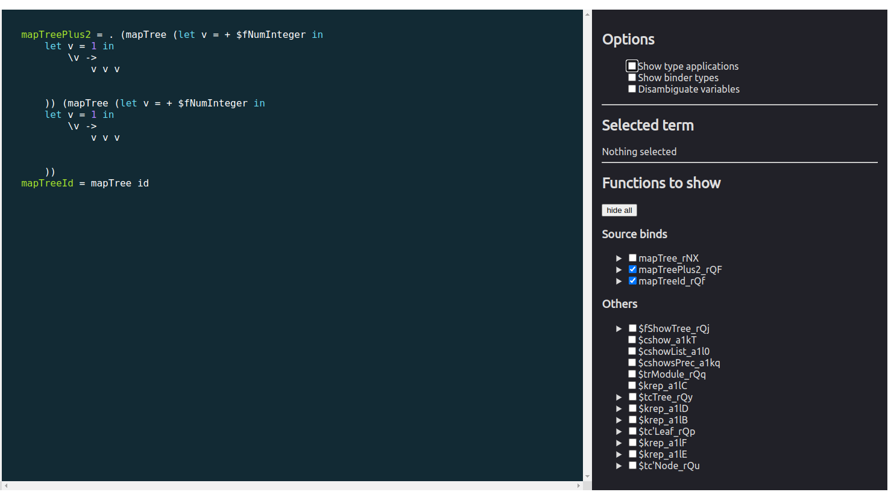
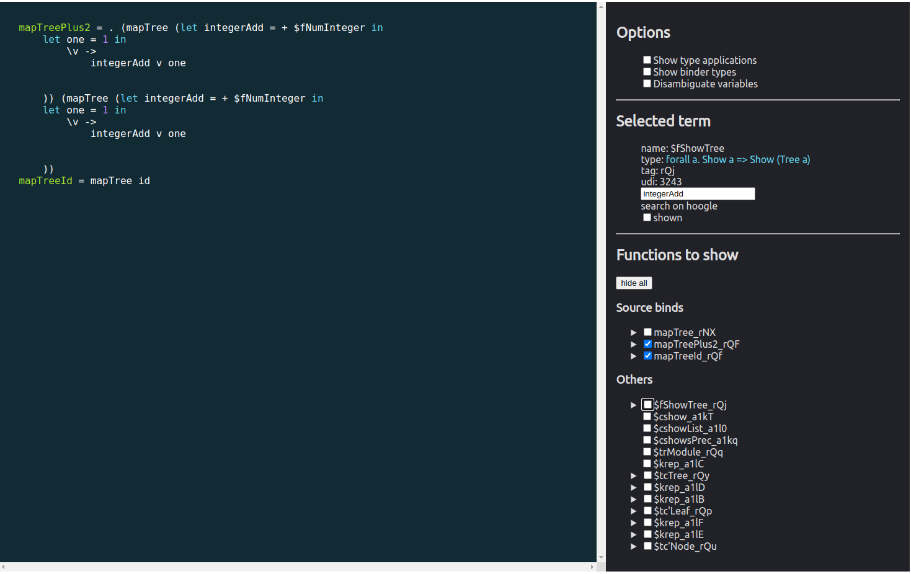

## Haskell Comprehension

Haskell is safe, but it can also be really fast. A high level language allows for high level optimisations.
However, GHC is not a magic deity. You can nudge it in the right direction but it can be tough to know if it understands you.

This tool allows you to look into the [ModGuts](https://hackage.haskell.org/package/ghc-lib-parser-9.2.2.20220307/docs/GHC-Unit-Module-ModGuts.html) of the beast, so to speak.

<small>
    HsComprehension is my thesis project at the University of Utrecht, copyright may apply.
</small>

### Contributing

- :exclamation: If you have a feedback, a feature request, or something appears to broken, do not hesitate to open an issue.
- :revolving_hearts: PRs are always welcome but not expected at this stage


### Quickstart

This project is currently pre alpha and not available on hackage yet. However it can be added as a local dependency

- :arrow_down: Clone this repository
- :pencil2: In your project, create a cabal.project file containing:
    ```
    packages: .
              , ../hs-comprehension
    ```
- :pencil2: In your projects cabal file, register the plugin
    ```
    ghc-options: -fplugin HsComprehension
    ```

- :construction_worker: Build your project, once the Main module is compiled, a local webserver is started
    ```
    ...
    finalizing info for module Main                      
    Running server at http://localhost:8080
    ```
- :mag: Inspect your codes GHC adventure in the  compiled frontend file in `elmfrontend/src/index.html` (Elm not required)

### Quick example: TreeMap with rewrites

Given a TreeMap module with some rewrite rules:

```haskell
module TreeMap where

data Tree a = Leaf a | Node (Tree a) (Tree a) deriving Show

{-# Rules
   "mapTree/mapTree"   forall f g.   mapTree f . mapTree g   = mapTree (f. g)   ;
   "mapTree/mapTree2"  forall t f g. mapTree f (mapTree g t)  = mapTree (f. g) t ;
   "mapTree/id"                      mapTree id               = id               ;
#-}

mapTree :: (a -> b) -> Tree a -> Tree b
mapTree f (Leaf x) = Leaf (f x)
mapTree f (Node lhs rhs) = Node (mapTree f lhs) (mapTree f rhs)

mapTreePlus2 :: Tree Int -> Tree Int
mapTreePlus2 = mapTree (+1) . mapTree (+1)

mapTreeId :: Tree a -> Tree a
mapTreeId = mapTree id
```

We can show inspect the initial core, also known as the desugared representation of the source;



We can use the renaming feature to restore some semantic intuition:



And inspect the next pass, a first run of the simplifier, which already confirms that our rewrite rules fired and produced a more desirable body for both our functions.


